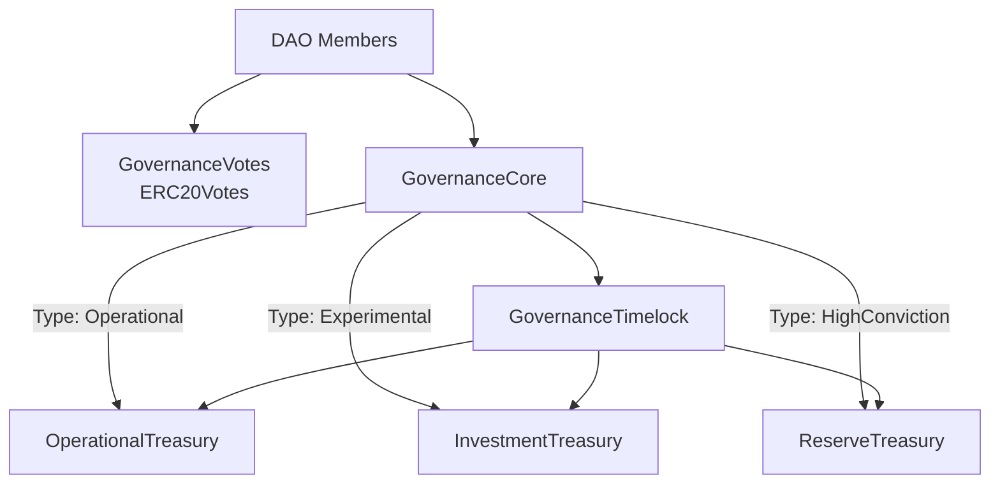
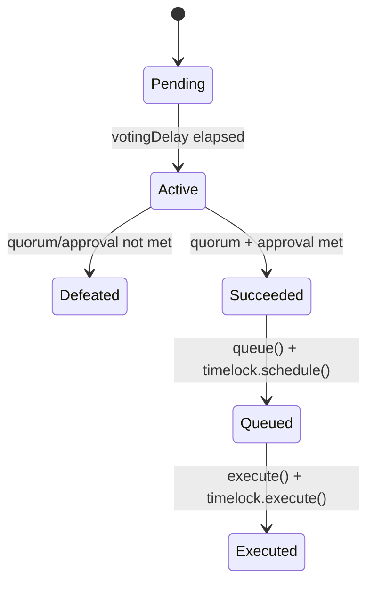
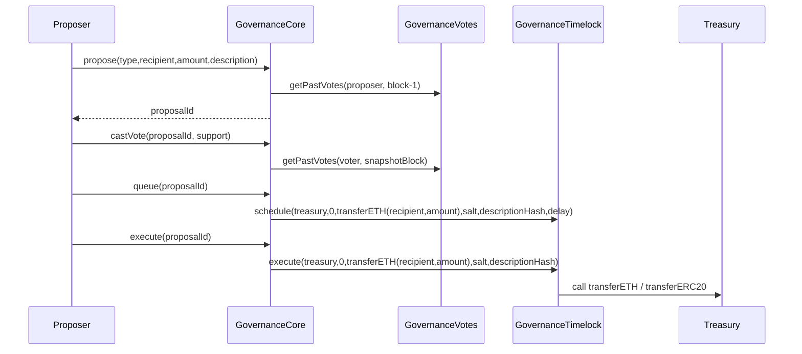
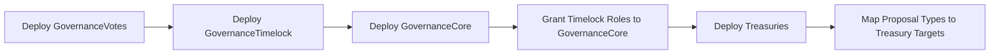

# 🚀 CryptoVentures Governance Protocol

> A modular, on-chain DAO governance system with non-linear vote weighting, delegation, timelock-protected execution, and tiered treasury controls.


---

## 🌐 Project Overview

CryptoVentures Governance Protocol enables members to create and govern treasury actions through a secure lifecycle:

- ETH `deposit()` mints governance stake 1:1 and self-delegates on first deposit
- Proposal creation with recipient + amount that executes through treasury `transferETH`
- Snapshot voting with delegation awareness
- Non-linear vote weighting (`sqrt`) to reduce whale dominance
- Timelock-enforced queue/execute controls
- Segmented treasury execution by proposal type
- Tier budget controls (60/30/10) with queued/executed accounting

The goal is to provide a production-style governance foundation that is transparent, auditable, and security-focused.

---

## 🧱 Tech Stack

| Layer | Tools |
|------|------|
| Smart Contracts | Solidity `0.8.28`, OpenZeppelin Contracts `4.9` |
| Development | Hardhat, ethers v6, TypeScript |
| Testing | Hardhat + Chai |
| Security Patterns | AccessControl, TimelockController, ERC20Votes snapshots |

---

## 🗂️ Code Structure & Folder Organization

```text
contracts/
  governance/
    GovernanceCore.sol         # Proposal lifecycle, vote tally, queue/execute
    GovernanceVotes.sol        # ERC20Votes token + delegation + snapshots
    GovernanceTimelock.sol     # Timelock controller wrapper
  treasury/
    TreasuryBase.sol           # Shared transfer logic + role gates
    OperationalTreasury.sol    # Lower-risk operational spending
    InvestmentTreasury.sol     # Medium-risk investment spending
    ReserveTreasury.sol        # Long-horizon reserve treasury
  interfaces/
  mocks/

scripts/
  deploy.ts                    # Deployment + role wiring + treasury mapping
  seed-state.ts                # Optional local state seeding (members, deposits, votes)

test/
  GovernanceFlow.test.ts       # End-to-end governance lifecycle tests
  Lock.ts                      # Hardhat sample test

.env.example
hardhat.config.ts
README.md
architecture.md
projectdocumentation.md
```

---

## 🔁 Workflow Explanation

### 1) Setup & bootstrap
1. Deploy `GovernanceVotes`, `GovernanceTimelock`, `GovernanceCore`
2. Grant timelock proposer/executor roles to `GovernanceCore`
3. Deploy treasuries and map each proposal type to one treasury target

### 2) Governance operation
1. Proposer creates proposal using `propose(type, recipient, amount, description)`
2. Members vote (`for`, `against`, `abstain`) with snapshot-based non-linear weight
3. If quorum + approval pass, proposal is queued in timelock
4. After delay, executor triggers timelock execution into treasury

### 3) Security enforcement
- Role-based access control on all critical actions
- One-vote-per-address per proposal
- One-way proposal state transition guards
- Timelock cancellation path via guardian role

---

## 📊 Execution Flow Diagrams

### A. System Architecture



### B. Proposal Lifecycle



### C. End-to-End Execution Sequence



### D. Deployment Workflow



---

## ⚙️ Setup & Installation

### Prerequisites

- Node.js 18+
- npm 9+

### Install

```bash
npm install
```

### Environment

Create `.env` from `.env.example` and provide network/deployer values:

```env
RPC_URL=http://127.0.0.1:8545
DEPLOYER_PRIVATE_KEY=0xYOUR_PRIVATE_KEY_HERE
GOV_MIN_DELAY_SECONDS=172800
GOV_VOTING_DELAY_BLOCKS=1
GOV_VOTING_PERIOD_BLOCKS=45818
GOV_QUORUM_BPS=2000
GOV_PROPOSAL_THRESHOLD_ETH=100
OPERATIONAL_MAX_ETH_TRANSFER=10
INVESTMENT_MAX_ETH_TRANSFER=100
```

---

## 🧪 Run Locally

### 1) Start local chain

```bash
npx hardhat node
```

### 2) Deploy protocol

```bash
npx hardhat run scripts/deploy.ts --network localhost
```

### 3) Run tests

```bash
npx hardhat test
```

Current status: ✅ all tests passing.

### NPM command shortcuts

```bash
npm run clean
npm run compile
npm run node
npm run deploy:local
npm run seed:local
npm test
```

`seed:local` requires deployed addresses in `.env`:

```env
GOVERNANCE_ADDRESS=0x...
OPERATIONAL_TREASURY_ADDRESS=0x...
INVESTMENT_TREASURY_ADDRESS=0x...
RESERVE_TREASURY_ADDRESS=0x...
```

---

## 🧭 Usage Instructions

Typical local governance run:

1. Deposit ETH via `GovernanceCore.deposit()` to receive governance stake
2. Delegate or undelegate with `delegateVotingPower()` / `undelegateVotingPower()`
3. Create proposal with recipient + amount
4. Wait voting delay, then cast votes
5. After voting period, queue proposal
6. Wait timelock delay, execute proposal
7. Confirm treasury balance/state changes

---

## 🔐 Security Posture

- **Access control:** `GOVERNOR_ROLE`, `EXECUTOR_ROLE`, `GUARDIAN_ROLE`
- **Timelock enforcement:** queue/execute routed through timelock operation hash
- **Vote integrity:** historical snapshots + one-vote-per-proposal enforcement
- **Treasury safety:** role-gated external transfer entrypoints

---

## 📚 Documentation Index

- `README.md` — Product-facing overview and quickstart
- `architecture.md` — Architecture/deep technical design
- `projectdocumentation.md` — Full project documentation and rationale

