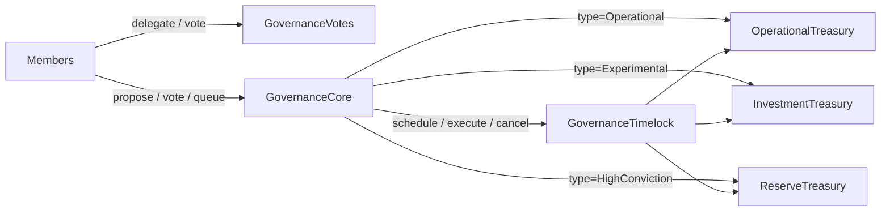
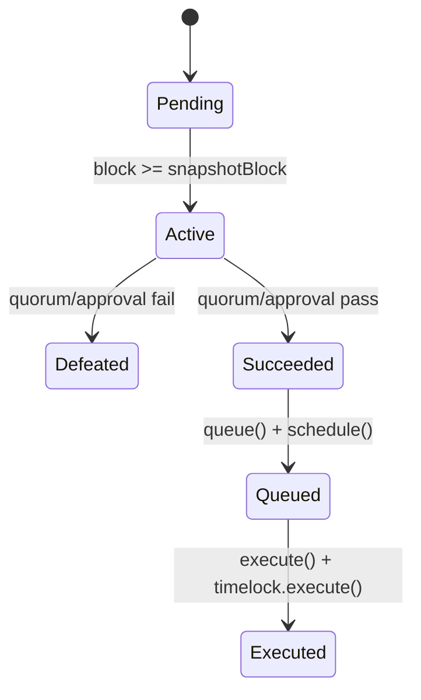
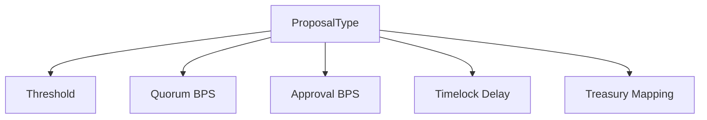
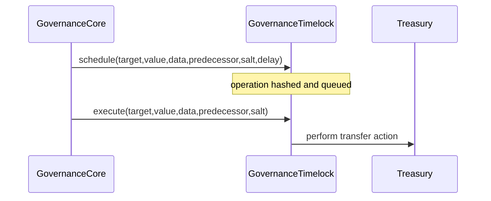
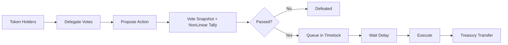
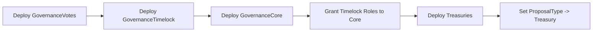

# Architecture Documentation — CryptoVentures Governance Protocol

## 1. Main Idea and Objective

The project implements a modular DAO governance protocol that securely coordinates treasury operations through token-based voting, timelocked execution, and role-based controls.

Core objectives:

- Enable transparent, on-chain proposal governance
- Preserve stake-based influence while reducing whale concentration
- Prevent immediate or unauthorized treasury execution
- Segment treasury operations by proposal type and risk level

---

## 2. High-Level System Architecture

### Architectural style

- Multi-contract, responsibility-separated design
- OpenZeppelin standards for voting and timelock primitives
- Explicit governance state machine inside `GovernanceCore`

---

## 3. Contracts and Responsibilities

| Module | Primary Responsibility | Key Security Traits |
|---|---|---|
| `GovernanceVotes` | ERC20Votes token, checkpoints, delegation | Snapshot integrity, delegation accounting |
| `GovernanceCore` | Proposal lifecycle and vote tally | Non-linear voting, role gates, state guards |
| `GovernanceTimelock` | Delayed operation scheduler/executor | Delay enforcement, operation hashing |
| `TreasuryBase` | Shared transfer internals for ETH/ERC20 | Role-gated transfer primitives |
| `OperationalTreasury` | Routine spending treasury | Transfer caps + executor gating |
| `InvestmentTreasury` | Mid-risk treasury | Transfer caps + executor gating |
| `ReserveTreasury` | Long-horizon reserve treasury | Strict role-gated execution |

---

## 4. Governance State Machine

State design properties:

- One-way transitions only
- Re-execution blocked by `executed` flag
- Voting only during active state

---

## 5. Proposal Type Architecture

The protocol defines three categories:

1. `Operational`
2. `Experimental`
3. `HighConviction`

Each type has independent configuration via `ProposalTypeConfig`:

- Proposal threshold
- Quorum in BPS
- Timelock delay
- Approval in BPS

And each type maps to an approved treasury target.

---

## 6. Voting Design and Rationale

### Mechanism

- Snapshot source: `getPastVotes(...)`
- Tally transform: `sqrt(linearVotes)`

This produces diminishing marginal influence for very large holders while preserving stake-based participation.

### Why this design

- More anti-concentration than linear voting
- Simpler and more intuitive than logarithmic weighting
- Smoother than hard capped voting systems

---

## 7. Delegation Design

Delegation uses ERC20Votes semantics:

- Delegation is explicit (`delegate`)
- Voting power at a proposal snapshot is fixed for that proposal
- Redelegation/revocation affects future snapshots

Edge behavior:

- Delegation changes during an active vote do not retroactively modify snapshot weight
- Delegation chains do not recursively amplify voting power
- Loop amplification is prevented by one-delegate accounting model

---

## 8. Timelock Design and Security

Queue/execute architecture:

1. Proposal passes governance checks
2. `queue(...)` schedules operation in timelock
3. Timelock delay elapses
4. `execute(...)` triggers delayed call

Security benefits:

- Prevents instant post-vote execution
- Gives monitoring and intervention window
- Binds action payload to operation hash, reducing mutation risk

---

## 9. Data Flow and Execution Flow

Data objects across lifecycle:

- Proposal metadata (`proposalType`, proposer, blocks)
- Execution payload (`target`, `value`, `data`, `descriptionHash`)
- Vote totals (`for`, `against`, `abstain`)
- Timelock tracking (`operationId`, `eta`)

---

## 10. Key Integrations

- OpenZeppelin `ERC20Votes` for historical vote checkpoints
- OpenZeppelin `TimelockController` for delayed execution
- OpenZeppelin `AccessControl` for role-based permissions
- Hardhat deployment script for role wiring and treasury mapping

---

## 11. Trade-Offs

### Advantages

- Clear modularity and auditability
- Strong execution controls via timelock and RBAC
- Type-aware governance policy tuning

### Limitations

- Single-action proposal payload (not batched arrays)
- Configuration admin remains a trust component
- Multi-contract setup increases deployment complexity

### Future improvements

- Multi-action batched proposals
- Governance-controlled config updates only
- Expanded fuzz/invariant testing suite

---

## 12. Deployment Architecture

This sequence ensures timelock authority and treasury routing are configured before governance operation begins.
