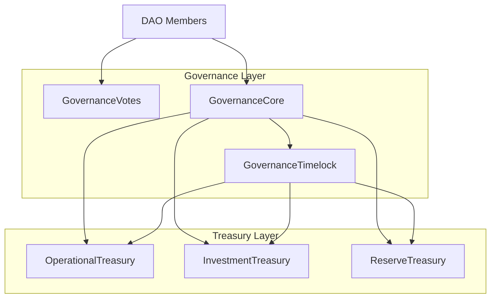
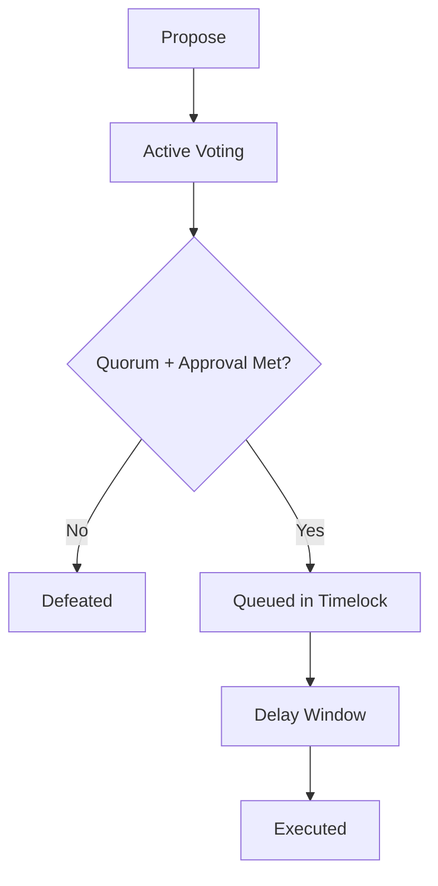
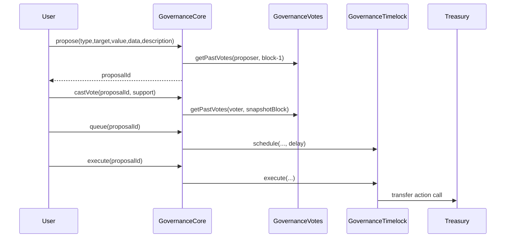
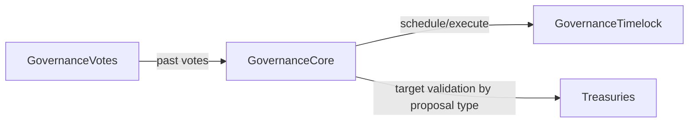

# Project Documentation — CryptoVentures Governance Protocol

## Executive Summary

CryptoVentures Governance Protocol is a full-stack smart contract governance backend focused on secure treasury operations. It combines stake-based governance, non-linear vote weighting, timelock delays, and role-based execution to reduce governance capture risk while preserving meaningful participation.

This document provides complete technical documentation for idea, architecture, modules, data flow, execution flow, security posture, and design trade-offs.

---

## 1) Main Idea and Objective

### Problem addressed

DAOs need mechanisms to:

- Decide treasury actions transparently
- Resist unilateral whale control
- Prevent rushed or unauthorized execution
- Maintain traceability and deterministic on-chain behavior

### Objective

Deliver a modular governance system where:

- Proposals are explicit executable actions
- Voting power is snapshot-based and non-linear
- Execution requires timelock delay
- Treasury transfers are strictly role-protected

---

## 2) System Design Overview

Design principles:

- Separation of concerns by contract boundary
- Minimal trust in external execution path
- Deterministic proposal lifecycle and role authorization

---

## 3) Tech Stack and Why It Was Chosen

| Technology | Why chosen |
|---|---|
| Solidity 0.8.28 | Modern compiler safety and ecosystem compatibility |
| OpenZeppelin | Battle-tested primitives for access, voting, timelock |
| Hardhat | Fast local iteration, deployment scripting, test tooling |
| TypeScript + ethers v6 | Typed deployment/test scripts and robust interaction layer |

Benefits of this stack:

- High auditability
- Standards alignment
- Faster development and verification loop

---

## 4) Core Modules and Responsibilities

### `GovernanceVotes`

- ERC20 token with vote checkpointing
- Delegation support
- Role-restricted mint/burn

### `GovernanceCore`

- Proposal creation and storage
- Proposal type policy enforcement
- Non-linear vote tallying using `sqrt`
- Lifecycle state resolution and transitions
- Timelock queue/execute integration

### `GovernanceTimelock`

- Delay-enforced scheduling and execution
- Operation hash-based tracking
- Cancel path integration

### Treasury contracts

- `TreasuryBase`: common ETH/ERC20 transfer internals
- `OperationalTreasury` / `InvestmentTreasury` / `ReserveTreasury`: risk-tiered external interfaces and policy caps

---

## 5) Workflow Explanation

### Governance workflow

1. Member proposes an action payload
2. Voting opens after voting delay
3. Members vote with snapshot-derived non-linear weight
4. If passed, proposal is queued in timelock
5. After delay, proposal is executed through timelock
6. Treasury performs action

---

## 6) Data Flow and Execution Flow

### Data model flow

- Proposal data: `proposalType`, proposer, target, value, calldata, hash, timestamps
- Voting data: for/against/abstain totals + voter participation mapping
- Timelock data: operation hash and ETA

### Runtime execution flow

---

## 7) Security Approach and Mitigations

### Top protections

1. **Unauthorized transfer prevention**
   - Mitigation: role checks on public treasury transfer entrypoints

2. **Instant governance execution prevention**
   - Mitigation: mandatory queue + timelock delay before execution

3. **Voting manipulation resistance**
   - Mitigation: checkpoint snapshots for historical vote retrieval

4. **Double voting prevention**
   - Mitigation: per-proposal `hasVoted` tracking

5. **Replay/re-execution prevention**
   - Mitigation: executed-state checks and one-way transitions

---

## 8) Problem-Solving Approach

### Key strategy

- Start from secure primitives instead of custom reimplementation
- Explicitly store executable payload to avoid ambiguous post-vote execution
- Apply non-linear vote transform to preserve influence while damping concentration
- Split treasuries by risk so governance policy can be tuned by category

### Why this works

- Improves traceability (every action is on-chain data)
- Reduces critical single-point logic complexity
- Allows governance policy flexibility per proposal category

---

## 9) Advantages, Benefits, Pros and Cons

### Advantages / Benefits

- Modular and maintainable architecture
- Strong security baseline with standard libraries
- Category-based governance tuning
- Timelock transparency and reaction window

### Cons / Trade-offs

- More deployment complexity than monolithic systems
- Additional cross-contract call overhead
- Current single-action proposal payload limits expressiveness

---

## 10) Crucial Integrations and Boundaries

Critical integration details:

- Governance must be granted proposer/executor roles on timelock
- Proposal type must map to correct treasury target
- Treasury executor role is timelock, not arbitrary EOAs

---

## 11) Testing and Verification

Current test suite validates:

- End-to-end proposal lifecycle
- Timelock wait before execution
- Double-vote rejection
- Balance change effects for treasury transfer execution

Result: all local tests pass.

---

## 12) Current Limitations and Improvement Plan

### Current limitations

- Single-target proposal payload model
- Config administration still centralized by admin role
- Limited adversarial test matrix compared to production-grade DAOs

### Improvement roadmap

1. Batched proposals (`targets[]`, `values[]`, `calldatas[]`)
2. Governance-controlled configuration updates
3. Expanded fuzz and invariant testing coverage
4. Richer on-chain analytics and proposal metadata indexing

---

## 13) Deployment and Local Operation Guide

### Setup

1. Install dependencies: `npm install`
2. Configure `.env` from `.env.example`
3. Start local node: `npx hardhat node`
4. Deploy: `npx hardhat run scripts/deploy.ts --network localhost`
5. Test: `npx hardhat test`

### Operational notes

- Ensure timelock roles are granted to governance core
- Ensure proposal type to treasury mappings are configured
- Ensure voting token holders self-delegate before voting

---

## 14) Conclusion

CryptoVentures Governance Protocol is designed as a practical, security-conscious governance foundation. Its combination of modular contract boundaries, timelock-controlled execution, and non-linear weighted voting makes it suitable for DAOs that value transparent on-chain decision making with explicit treasury safety controls.
